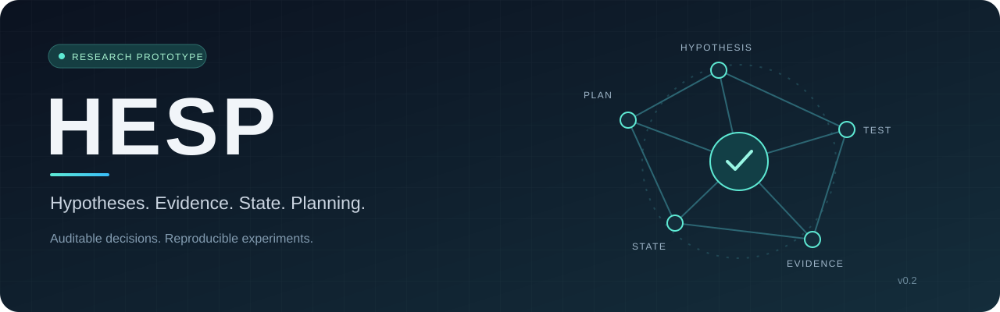

<div align="center">



**让每一步探索，都有可检验的依据。**

一个围绕假设、证据与业务状态组织行动的 Agent 研究原型。

[](https://github.com/lzwhehe/HESP/actions/workflows/verify.yml)


[快速开始](#快速开始) · [工作原理](#工作原理) · [验证记录](#验证记录) · [研究路线](#研究路线) · [English](docs/README.en.md)

</div>

---

## 为什么做 HESP

复杂任务中的 Agent 不仅需要记住发生了什么，还需要判断：**下一步做什么，才能有效区分当前的解释？**

HESP 将调查过程组织为可追溯的循环：建立局部假设、登记测试预测、选择行动、记录观察、更新证据，并在业务状态变化后重新规划。研究关注的问题是：在相同模型、工具和预算下，诊断式行动选择能否在结构化记忆之外带来额外收益？

> **研究阶段：工程验证。** 当前使用手工模拟任务与脚本策略，未执行真实 LLM 或 Web CTF 实验。测试数据说明软件流程可运行，不代表方法优于其他 Agent。

## 核心能力

| 能力 | 实现方式 |
| :--- | :--- |
| **假设驱动的选择** | 根据给定预测表计算预期信息增益，并按工具成本排序 |
| **可追溯的证据** | 执行前登记预测，执行后保存原始观察、来源与更新记录 |
| **感知业务状态** | 状态版本变化时重置当前分数，保留历史证据 |
| **统一对照条件** | 三种模式共享工具、预算、精确去重和独立验证器 |
| **可复现的执行** | 固定种子、随机运行顺序、冻结 manifest 与源码哈希 |
| **可检查的结果** | 日志审计、失败分类、未知用量处理与配对统计 |

## 工作原理


预测表中的概率来自人工模拟规则。信息增益是给定预测模型下的计算值；分数升高不等于任务成功，最终判断必须通过独立验证器。

### 三种对照模式

| 模式 | Planner 可见信息 | 行动选择 |
| :--- | :--- | :--- |
| `react_style` | 目标、工具、完整历史 | Planner 决定 |
| `memory_only` | 上述信息 + 结构化假设、状态与证据 | Planner 决定 |
| `hesp` | 上述信息 + 候选信息增益与成本 | 控制器按信息增益 / 成本选择 |

`react_style` 是接口形态，不是 ReAct 论文的忠实复现。目前三组共用脚本策略，仅用于验证控制流程。

## 快速开始

**Python 3.10+ · 仅标准库 · 无需 API 密钥**

```bash
git clone https://github.com/lzwhehe/HESP.git
cd HESP/hesp_research

# 1. 验证软件
python -m unittest discover -s tests -v

# 2. 跑通一次诊断
python -m hesp --mode hesp --case owner_policy --output runs/first_run

# 3. 执行三组配对模拟
python scripts/run_study.py --output runs/study --repeats 3 --seed 42

# 4. 审计单次运行
python scripts/audit_run.py runs/first_run
```

输出目录必须不存在，以避免覆盖历史结果。完整参数和外部进程接口见 [原型使用说明](hesp_research/README.md) 和 [模型适配协议](hesp_research/docs/MODEL_ADAPTER.md)。

### 一次运行会留下什么

```text
runs/first_run/
├── config.json       # 模式、预算、预测表与源码哈希
├── events.jsonl      # 预测 → 行动 → 观察 → 证据 → 验证
└── result.json       # 状态、资源用量与独立验证结果

runs/study/
├── manifest.json     # 运行前冻结的顺序与配置
├── outcomes.jsonl    # 逐次持久化的结果
├── analysis.json     # 分组统计与任务聚类配对分析
├── report.md         # 可直接阅读的摘要
└── run*/             # 每次运行的完整记录
```

## 验证记录

以下为 **2026-09-22 本机 v0.2 工程验证**，不是实时 CI 指标。顶部徽章展示远端 CI 状态。

| 验证项 | 已记录结果 | 原始证据 |
| :--- | :--- | :--- |
| 单元与集成测试 | **50 / 50 通过** | [测试记录](hesp_research/results/verification_v02/unittest.txt) |
| 配对模拟 | **36 次完成**，4 类原因 × 3 模式 × 3 次重复 | [运行清单](hesp_research/results/study_v02/manifest.json) |
| 模拟独立验证 | **36 / 36 通过** | [完整结果](hesp_research/results/study_v02/summary.json) |
| 统计管线 | 失败保留在分母，未知用量保留为 null | [分析输出](hesp_research/results/study_v02/analysis.json) |

固定策略与确定性任务的重复执行用于验证管线。这里的完成率、工具调用差异和区间不能用于真实模型效果或统计显著性结论。

## 项目导航

```text
HESP/
├── .github/                 # CI、研究任务与 PR 模板
├── docs/                    # 项目视觉与英文介绍
└── hesp_research/
    ├── hesp/                # 控制器、证据账本、规划器与分析
    ├── tests/               # 数值、协议、预算与回归测试
    ├── scripts/             # 验证、实验、审计与打包入口
    ├── docs/                # 研究协议、接口与进度
    └── results/             # 保留的 v0.1 / v0.2 验证记录
```

| 想了解什么 | 从这里开始 |
| :--- | :--- |
| 研究问题、对照与统计口径 | [研究协议](hesp_research/docs/PROTOCOL.md) |
| 原始模拟演示发生了什么 | [第一阶段运行说明](hesp_research/docs/FIRST_RUN.md) |
| 如何接入外部 Planner | [模型适配协议](hesp_research/docs/MODEL_ADAPTER.md) |
| 已完成与尚未完成的工作 | [后续工作记录](hesp_research/docs/CONTINUATION.md) |
| 如何贡献与复现 | [贡献说明](CONTRIBUTING.md) |
| 每个版本改了什么 | [更新日志](CHANGELOG.md) |

## 研究路线

- [x] **01 · 原型** — 调查状态、证据更新、信息增益、三组控制流程。
- [x] **02 · 工程验证** — 配对模拟、日志审计、统计管线与自动检查配置。
- [ ] **03 · 模型 Pilot** — 真实模型、候选与预测生成、完整费用记录。
- [ ] **04 · 授权 Web 环境** — 隔离任务、独立验证器、环境重置与访问边界。
- [ ] **05 · 正式研究** — 冻结任务划分与指标，执行对照、消融并报告负结果。

当前按“暂不付费，先完成工程与实验准备”推进。真实实验需先确定模型、费用上限和授权任务范围。

---

<div align="center">

**Hypotheses → Evidence → State → Planning**

让研究过程可检查，让结论回到证据。

</div>
