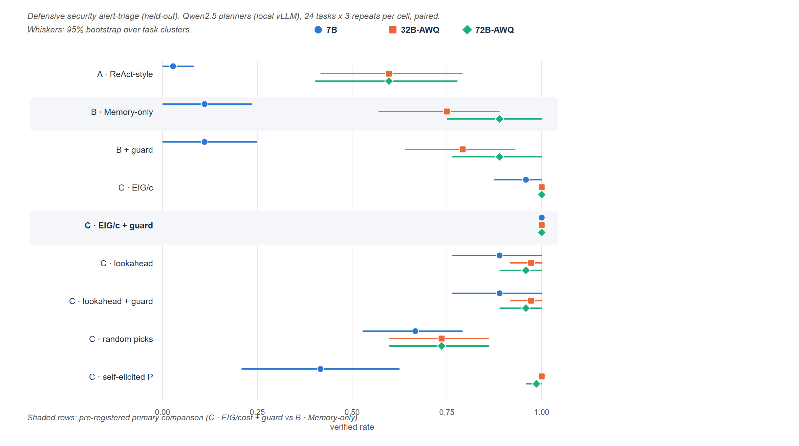

<div align="center">


**让每一步探索，都有可检验的依据。**

一个围绕假设、证据与业务状态组织行动的 Agent 研究原型。

[](https://github.com/lzwhehe/HESP/actions/workflows/verify.yml)


[快速开始](#快速开始) · [工作原理](#工作原理) · [实验结果](#实验结果) · [研究路线](#研究路线) · [English](docs/README.en.md)

</div>

---

## 为什么做 HESP

复杂任务中的 Agent 不仅需要记住发生了什么，还需要判断：**下一步做什么，才能有效区分当前的解释？**

HESP 将调查过程组织为可追溯的循环：建立局部假设、登记测试预测、选择行动、记录观察、更新证据，并在业务状态变化后重新规划。研究关注的问题是：在相同模型、工具和预算下，诊断式行动选择能否在结构化记忆之外带来额外收益？

> **研究阶段：本地靶场上的受控实验。** v0.4 在两个自建的本地 Web 诊断靶场上，用三档本地部署的开源模型（Qwen2.5 7B / 32B / 72B）完成了 3888 个预先登记、配对进行的回合。结论只适用于这些靶场，**不是** Web CTF 或真实网站上的结论。

## 核心能力

| 能力 | 实现方式 |
| :--- | :--- |
| **假设驱动的选择** | 根据给定预测表计算预期信息增益；可选 EIG/cost、预算感知的前瞻（lookahead）等选择器 |
| **可追溯的证据** | 执行前登记预测，执行后保存原始观察、来源与更新记录 |
| **感知业务状态** | 状态版本变化时重置当前分数；状态守卫拒绝引用旧状态证据下的结论 |
| **授权本地靶场** | 仅监听 127.0.0.1 的 HTTP 诊断应用（web-diag / upload-diag），含状态漂移与噪声变体 |
| **本地大模型** | Ollama 与 vLLM（OpenAI 兼容）后端，服务端报告 usage，无需任何 API 密钥 |
| **统一对照条件** | 三种模式共享工具、预算、精确去重和独立验证器 |
| **可复现的执行** | 固定种子、随机运行顺序、冻结 manifest 与源码哈希 |
| **可检查的结果** | 日志审计、失败分类、未知用量处理与配对统计 |

## 工作原理


<sub>HESP 的调查环路，以 sec-triage 告警 INC-4271 为例，图中数值取自一个真实回合（由 `docs/figures/make_framework_figure.py` 重放生成）。蓝色为控制器：它维护候选原因的后验 <i>p<sub>t</sub>(h)</i>，按单位成本的期望信息增益 EIG/<i>c</i> 选择只读探针，并用预测模型 <i>P</i>(<i>o</i> | <i>h</i>, <i>a</i>) 做贝叶斯更新；<i>P</i> 可来自设计者（oracle 上界）、<i>k</i> 个开发回合的计数（本例，<i>k</i> = 20）或模型自抽取。LLM 规划器 π 读取账本与排序，但它提议的探针只在基线中生效——本例中 π 提议 <code>auth_log</code>，控制器执行 <code>source_ips</code>。π 提交的结论须先通过结案守卫，再由能看到隐藏真因 <i>h</i>* 的独立验证器判定；守卫拒绝时把原因返回给 π。红色虚线内的一切对 π 不可见。评估协议见 [PROTOCOL.md](hesp_research/docs/PROTOCOL.md)。矢量版本：[PDF](docs/assets/hesp-framework.pdf) · [SVG](docs/assets/hesp-framework.svg)。</sub>


预测表中的概率来自人工模拟规则。信息增益是给定预测模型下的计算值；分数升高不等于任务成功，最终判断必须通过独立验证器。

### 三种对照模式

| 模式 | Planner 可见信息 | 行动选择 |
| :--- | :--- | :--- |
| `react_style` | 目标、工具、完整历史 | Planner 决定 |
| `memory_only` | 上述信息 + 结构化假设、状态与证据 | Planner 决定 |
| `hesp` | 上述信息 + 候选信息增益与成本 | 控制器按信息增益 / 成本选择 |

`react_style` 是接口形态，不是 ReAct 论文的忠实复现。三组使用同一个模型、同一套提示模板、同样的工具、预算、精确去重和验证器，区别只在于请求中包含哪些段落，以及由谁来选动作。

## 快速开始

**Python 3.10+ · 仅标准库 · 无需 API 密钥**

```bash
git clone https://github.com/lzwhehe/HESP.git
cd HESP/hesp_research

# 1. 验证软件
python -m unittest discover -s tests -v

# 2. 跑通一次诊断
python -m hesp --mode hesp --case owner_policy --output runs/first_run

# 3. 执行三组配对模拟
python scripts/run_study.py --output runs/study --repeats 3 --seed 42

# 4. 审计单次运行
python scripts/audit_run.py runs/first_run

# 5. 本地 Web 靶场 + 选择器消融（脚本 Planner，无需模型）
python -m hesp --env web --case owner_policy --variant drift --output runs/web_demo
python scripts/run_web_ablation.py --output runs/ablation --repeats 1

# 6. 接本地模型（需 Ollama 或 vLLM，见模型适配协议）
python -m hesp --env web --mode hesp --llm qwen2.5:7b-instruct --output runs/llm_demo
```

输出目录必须不存在，以避免覆盖历史结果。完整参数和外部进程接口见 [原型使用说明](hesp_research/README.md) 和 [模型适配协议](hesp_research/docs/MODEL_ADAPTER.md)。

### 一次运行会留下什么

```text
runs/first_run/
├── config.json       # 模式、预算、预测表与源码哈希
├── events.jsonl      # 预测 → 行动 → 观察 → 证据 → 验证
└── result.json       # 状态、资源用量与独立验证结果

runs/study/
├── manifest.json     # 运行前冻结的顺序与配置
├── outcomes.jsonl    # 逐次持久化的结果
├── analysis.json     # 分组统计与任务聚类配对分析
├── report.md         # 可直接阅读的摘要
└── run*/             # 每次运行的完整记录
```

## 实验结果

完整报告：[**RESULTS.md**](hesp_research/docs/RESULTS.md)。分析口径在运行前登记于 [PROTOCOL.md](hesp_research/docs/PROTOCOL.md)；每个数字都能追溯到 `hesp_research/results/` 中的原始日志，所有回合都通过了日志审计。



**v0.6(RQ3:不再依赖 oracle 预测表)。** 此前所有 HESP 结果都用了由环境生成函数平滑而来的"设计者预测表"。v0.6 把它换成**只从开发期观测计数得到的表**(估计代码从结构上碰不到生成函数),预先登记并冻结后在三档模型上跑了 1728 个回合:

| Planner | 主要终点 `emp20 − memory_only` [95% 区间] | 成功率的 oracle 差距 | 多花的探针成本 |
| --- | --- | ---: | ---: |
| **Qwen2.5-7B(确认性)** | **+0.875 [+0.736, +0.972]** | 0.000 | +2.33 |
| Qwen2.5-32B-AWQ | +0.250 [+0.097, +0.417] | 0.000 | +2.44 |
| Qwen2.5-72B-AWQ | +0.111 [0.000, +0.236] | 0.000 | +1.21 |

不含 LLM 的检验显示,**多出来的成本全部来自开发数据观测不到的"未知原因"那一行**。数据效率曲线在 k=5 就饱和,这是靶场近乎确定性造成的,不能据此说明方法在嘈杂环境中数据高效——这要留给外部基准检验。完整结果与局限见 [RESULTS.md §10](hesp_research/docs/RESULTS.md)。

**v0.5 主研究(防御安全告警分诊,留出任务族)。** 把 v0.4 事后发现的"EIG/cost + 状态守卫"作为**预先登记的主方案**在全新的安全任务族上确认。预先登记的主要终点(相对结构化记忆的验证完成率配对差)**在 7B 和 32B 上区间不含 0,在 72B 上包含 0**:

| Planner | 主要终点 Δ [95% 区间] | Memory-only 自身 |
| --- | --- | ---: |
| Qwen2.5-7B | +0.8889 [+0.7500, +1.0000] | 0.111 |
| Qwen2.5-32B-AWQ | +0.2500 [+0.0972, +0.4167] | 0.750 |
| Qwen2.5-72B-AWQ | +0.1111 [**0.0000**, +0.2361] | 0.889 |

表格由 `hesp_research/scripts/v05_summary.py` 从原始 `outcomes.jsonl` 生成。**早先版本曾写"三个模型区间都不含 0",这是错的**——更正与其余四条勘误见 [RESULTS.md §9](hesp_research/docs/RESULTS.md)。

弱模型在安全分诊上几乎完全靠 HESP 才能完成(7B 自己查只有 0.03–0.11,陷入"探测→再确认→不下结论"死循环;HESP 升到 0.96–1.00 且成本更低)。完整数据见 [RESULTS.md §8](hesp_research/docs/RESULTS.md)。

---

**v0.4 主研究(运维/上传诊断)。**

**v0.4 主研究**（留出任务族 upload-diag，9 个 arm × 48 个任务 × 3 次重复 × 3 个模型）。预先登记的主要终点是完整 HESP 相对结构化记忆（Memory-only）的验证完成率配对差：

| Planner | 完整 HESP − Memory-only [95% 任务聚类区间] | Memory-only 完成率 |
| --- | --- | ---: |
| Qwen2.5-7B | **+0.625** [+0.44, +0.79] | 0.236 |
| Qwen2.5-32B-AWQ | **+0.000** [−0.12, +0.12] | 0.944 |
| Qwen2.5-72B-AWQ | **+0.111** [+0.03, +0.22] | 0.819 |

- **收益随 Planner 变强而缩小。** 7B 自己决策时会过早下结论，由控制器挑选探针弥补了这一点；32B 上优势消失。
- **探索性发现：** EIG/cost + 状态守卫在留出族上三个模型都达到 1.000，需要新的预注册研究来确认。
- **负面结果：** 预算感知 lookahead 在开发族上更好，在留出族上却没有更好，改进没有跨任务族泛化；模型自己生成的预测表校准较差（KL 0.86–1.76 比特）。

| 记录 | 规模 | 原始证据 |
| :--- | :--- | :--- |
| v0.4 三档模型主研究 | 3888 回合，源码哈希固定，全部通过审计 | [汇总](hesp_research/results/v04_summary.md) |
| v0.3 笔记本 Pilot（7B Q4） | 240 回合 | [报告](hesp_research/results/llm_pilot_v03/report.md) |
| 选择规则消融（无模型） | 5880 回合 × 7 档预算 | [曲线](hesp_research/results/web_ablation_v031/curve.json) |
| 预测校准 | 3 个模型 × 2 个任务族 | [RESULTS §4–5](hesp_research/docs/RESULTS.md) |
| 软件测试 | 97 项，Windows / Linux | `python -m unittest discover -s tests` |

## 项目导航

```text
HESP/
├── .github/                 # CI、研究任务与 PR 模板
├── docs/                    # 项目视觉与英文介绍
└── hesp_research/
    ├── hesp/                # 控制器、证据账本、规划器与分析
    ├── tests/               # 数值、协议、预算与回归测试
    ├── scripts/             # 验证、实验、审计与打包入口
    ├── docs/                # 研究协议、接口与进度
    └── results/             # 保留的 v0.1 / v0.2 验证记录
```

| 想了解什么 | 从这里开始 |
| :--- | :--- |
| 全部实验结果与局限 | [实验结果](hesp_research/docs/RESULTS.md) |
| 研究问题、对照与统计口径 | [研究协议](hesp_research/docs/PROTOCOL.md) |
| 原始模拟演示发生了什么 | [第一阶段运行说明](hesp_research/docs/FIRST_RUN.md) |
| 如何接入外部 Planner | [模型适配协议](hesp_research/docs/MODEL_ADAPTER.md) |
| 已完成与尚未完成的工作 | [后续工作记录](hesp_research/docs/CONTINUATION.md) |
| 如何贡献与复现 | [贡献说明](CONTRIBUTING.md) |
| 每个版本改了什么 | [更新日志](CHANGELOG.md) |

## 研究路线

- [x] **01 · 原型** — 调查状态、证据更新、信息增益、三组控制流程。
- [x] **02 · 工程验证** — 配对模拟、日志审计、统计管线与自动检查配置。
- [x] **03 · 模型 Pilot** — 本地 7B 模型、预测抽取、完整 usage 记录（v0.3）。
- [x] **04 · 授权本地 Web 环境** — 仅回环地址的两个诊断靶场、独立验证器、每回合重置（v0.3–v0.4）。
- [x] **05a · 受控主研究** — 预先登记、留出任务族、三档模型、因子化消融，报告负面结果（v0.4）。
- [ ] **05b · 确认性研究** — 以 EIG/cost + 守卫为新的主要 arm 预先登记；增加他人编写的第三个任务族和其他模型家族。
- [ ] **06 · 开放式假设** — 由模型生成并扩展假设集合，而不是由任务提供。

所有模型都在本地运行（Ollama / vLLM），不产生 API 费用。

---

<div align="center">

**Hypotheses → Evidence → State → Planning**

让研究过程可检查，让结论回到证据。

</div>
