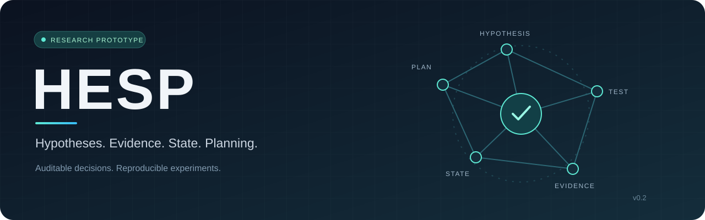
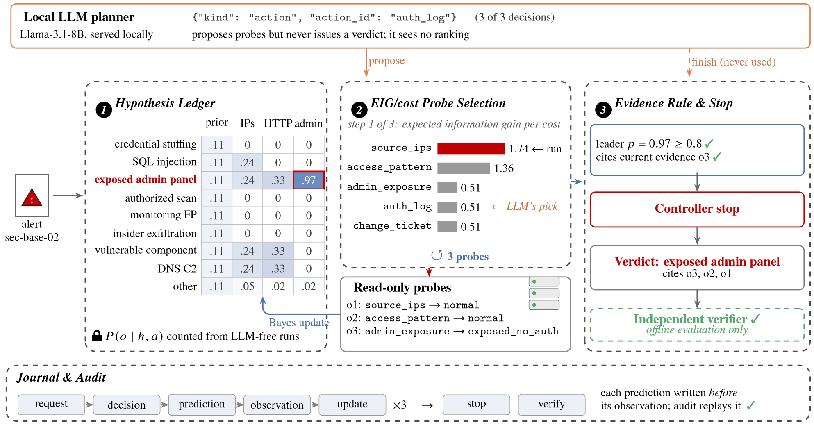

<div align="center">



**让小型本地 LLM 能用于告警分诊：模型负责读日志，控制器负责决定。**

[](https://arxiv.org/abs/2609.33446)
[](https://github.com/lzwhehe/HESP/actions/workflows/verify.yml)


[论文](#论文) · [核心结果](#核心结果) · [工作原理](#工作原理) · [快速开始](#快速开始) · [仓库结构](#仓库结构) · [研究记录](#研究记录) · [English](docs/README.en.md)

</div>

---

## 要解决的问题

不能把遥测数据发给外部模型的组织，只能用自己机器上的小模型（7B/8B）来分诊安全告警。但这些模型单独做不到：它们不会选下一步该查什么，也不会判断证据何时已经足够。

不过，很多告警属于反复出现的类型。对这类告警，分析员已经知道可能的原因有哪些、用什么检查能区分它们，以及以往案例是怎么结案的。**HESP 面向的就是这类已知告警类型。** 它把分诊拆成两项工作：

| 工作 | 由谁完成 | 具体内容 |
| :--- | :--- | :--- |
| **读** | 小模型 | 把探针返回的原始日志文本，读成分析员事先定义好的某个结果 |
| **决定** | 控制器 | 选下一个探针、判断何时停止、只接受有证据支持的结论 |

## 论文

**HESP: Making Small Local LLMs Usable for Alert Triage — The Model Reads the Logs, a Controller Decides**
arXiv: [2609.33446](https://arxiv.org/abs/2609.33446)（v2）。论文源码在 [`paper_read/`](paper_read/)，中文审阅稿在 [`paper_read/zh/`](paper_read/zh/)。

## 核心结果

sec-triage 场景，每格 48 个回合中被独立验证器判为正确的数量（Qwen2.5-7B / Llama-3.1-8B）：

| 谁决定 | 谁读 | 结构化观测（已给标签） | 原始日志（原格式） | 原始日志（格式变化后） |
| :--- | :--- | ---: | ---: | ---: |
| 小模型单独（四种配置中最好的） | 模型 | 13 / 0 | 0 / 0 | **0 / 0** |
| 控制器 | 固定规则 | 48 / 48 | 48 / 48 | **0 / 0** |
| 控制器 | 模型 | — | 48 / 48 | **48 / 34** |

- **两半都不能单独工作。** 小模型单独面对原始日志时一个案例也解决不了。它读得懂日志，却不结案，而是反复要求重跑同一个探针。控制器单独时，日志格式一变，规则解析器就一条也读不出。两者结合才能解决。
- **做决定不需要模型。** 观测已经结构化时，不含任何模型的控制器在两个场景中解决了全部案例，五个 7B–72B 模型都没有超过它。
- **读取是攻击面。** 攻击者把一致的良性故事写进每条日志，就能让作为读取器的 Qwen2.5-7B 把 36 个攻击全部结为良性。HESP 不让模型读出的证据支持良性结论，挡住了测试过的所有攻击，代价是没有可信解析器时，诚实的良性案例会被升级给人工。

**适用范围。** 三个场景都是模拟的；候选原因、探针和结果由人事先写好，且每个原因都会留下一条独特的观测；预测表统计自确定性的生成器。新的告警类型，以及从真实工单统计的预测表，都不在已检验的范围内。详见论文的局限部分。

## 工作原理



<sub>一个真实回合（sec-base-02，Llama-3.1-8B 作为规划器）：模型只提议探针，从不结案；控制器按单位成本的期望信息增益选择探针，用贝叶斯公式更新各原因的概率，在领先原因的后验达到 0.8、且有当前证据支持时结案。每一步预测都先写入日志，再执行观测。</sub>

每拿到一个结果，控制器依次：

1. **更新账本。** 用预测表 $P(o \mid h, a)$ 按贝叶斯公式更新每个候选原因的概率。预测表从已知原因的开发案例中计数得到，不让模型估计。
2. **判断能否结案。** 领先原因的后验达到阈值，并且至少有一条当前观测能把它单独挑出来时才结案（确认停止）。
3. **选下一个探针。** 计算每个探针的期望信息增益除以成本，执行最高的那个。
4. **保护结论。** 结束守卫拒绝账本不支持的结论；良性结论必须有两个独立来源组佐证；模型解析出的观测不能支持良性结论（读取器信任）。

## 快速开始

**Python 3.10+，只用标准库，不需要 API 密钥。** 下面的命令都不需要 GPU。

```bash
git clone https://github.com/lzwhehe/HESP.git
cd HESP/hesp_research

# 单元测试（约 1 分钟）
python -m unittest discover -s tests

# 不含 LLM 的控制器在一个案例上的逐步过程
python scripts/demo_controller_trace.py --cause dns_c2

# 行为指纹：288 个不含 LLM 的回合，应输出 digest 3d9e5bc5...
python scripts/check_equivalence.py

# 从结果文件重新生成汇总，再生成论文表格
python scripts/v14_summary.py
python ../paper_read/make_tables.py
```

接本地模型（vLLM 或 Ollama，OpenAI 兼容接口）的方法见 [模型适配协议](hesp_research/docs/MODEL_ADAPTER.md)；各研究在 H100 上的运行脚本在 [`hesp_research/scripts/server/`](hesp_research/scripts/server/)。

## 仓库结构

```text
HESP/
├── hesp_research/          代码、测试、实验脚本与全部结果
│   ├── hesp/               控制器、账本、选择器、环境（sec / sigma / comp-triage）、原始日志读取
│   ├── scripts/            各研究的运行与汇总脚本（run_v*_study.py、v*_summary.py）
│   ├── tests/              单元测试
│   ├── results/            每个研究的 outcomes.jsonl、汇总与回合日志归档（含哈希）
│   └── docs/               PROTOCOL.md（预注册）、RESULTS.md、外部数据集审计
├── paper_read/             论文 v2（当前版本）：LaTeX 源码、表格生成脚本、中文稿、arXiv 打包脚本
├── paper/                  另一篇稿件：LLM 安全运营基准的捷径审计
├── arxiv_v2/               对 v1 的最小更正版（已被 paper_read 取代，保留备查）
└── docs/                   README 图片与英文说明
```

## 研究记录

每项研究都在运行前写入 [PROTOCOL.md](hesp_research/docs/PROTOCOL.md) 并冻结源码哈希；失败的预测和勘误都保留在记录中，论文中的每个数字都由脚本从 `hesp_research/results/` 生成。

| 研究 | 问题 | 主要发现 |
| :--- | :--- | :--- |
| v0.3–v0.5 | 信息增益选择是否帮助本地模型完成诊断 | 7B 模型自己查只有 0.03–0.11，HESP 下 0.96–1.00 |
| v0.6 | 预测表能否不依赖设计者 | 从开发回合计数得到的表与设计者的表效果相同 |
| v0.7 | GUIDE 真实事件上的冷启动 | 冻结前发现主要终点无效，已暂停；测试集未读取 |
| v0.8 | 在规划器信息相同时，排序本身是否有用 | 有用（+0.26 到 +0.35）；Llama-3.1-8B 从不结案 |
| v0.9 | 由控制器负责停止 | Llama-3.1-8B 从 0 升到 0.917 |
| v1.0–v1.1 | Sigma 规则场景、确认停止、攻击与公平比较 | 不含模型的控制器 72/72、152/152；没有模型超过它 |
| v1.2 | 更好的提示词；探针返回原始日志 | 格式变化后规则解析器 0/364，模型读取 48/48 |
| v1.3 | 针对模型读取器的自适应攻击 | 读取器信任规则把漏判降到 0/36 |
| v1.4 | 小模型单独面对原始日志 | 两个模型所有配置 0/48；Qwen 的措辞检查同样 0/48 |

## 引用

```bibtex
@misc{liu2026hesp,
  title         = {{HESP}: Making Small Local {LLMs} Usable for Alert Triage -- The Model Reads the Logs, a Controller Decides},
  author        = {Liu, Zhuowen and Wang, Zhixuan},
  year          = {2026},
  eprint        = {2609.33446},
  archivePrefix = {arXiv}
}
```
