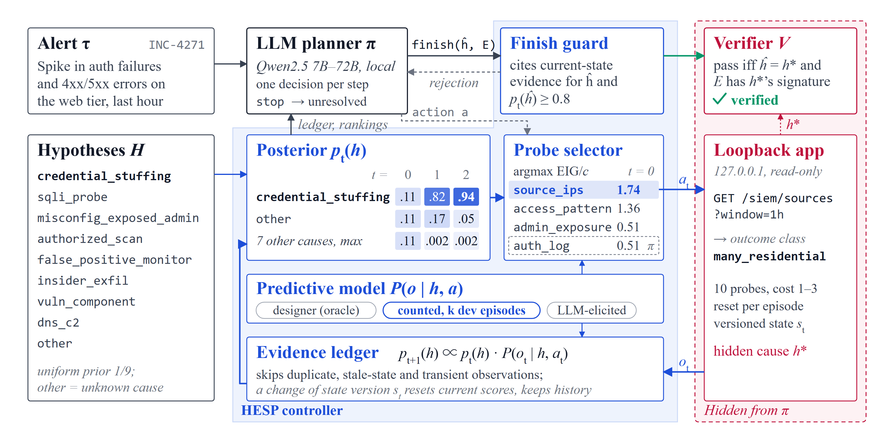
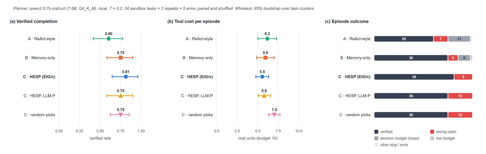
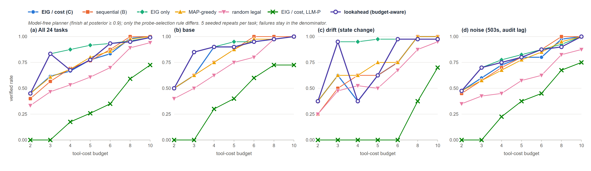
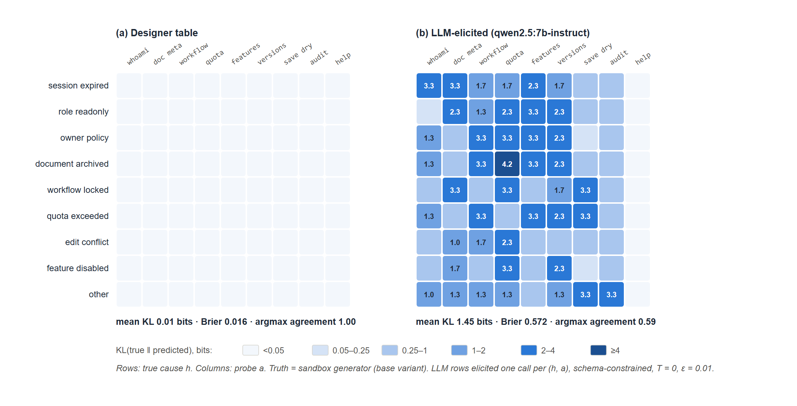
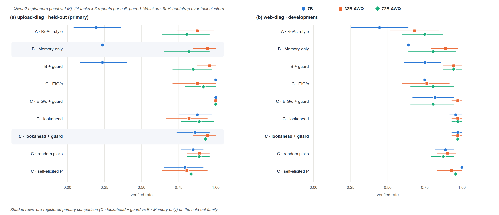

# HESP 实验结果（v0.3 – v0.4）

本文汇总 2026-09-23 实际完成的全部实验。每个数字都能追溯到 `results/` 中的原始日志；所有回合都通过了日志一致性审计（`hesp.audit`），失败全部留在分母中，缺失的 token 用量记为 null。任务是自建的本地诊断靶场，不是 Web CTF，结论只描述这些靶场。



## 1 · 结论摘要

**v0.4（主研究，3888 个回合，全部通过审计）：**

1. **预先登记的主要终点**（留出族 upload-diag 上，完整 HESP 相对 Memory-only 的验证完成率配对差）：7B **+0.625** [+0.44, +0.79]；32B **+0.000** [−0.12, +0.12]；72B **+0.111** [+0.03, +0.22]。收益随 Planner 变强而明显缩小，但并不单调。对弱 Planner 的收益主要来自由控制器挑选探针：7B 自己决策时平均只花 1 个成本单位就急着下结论。
2. **探索性发现（事后观察，非预先登记）：** 「EIG/cost + 状态守卫」在留出族上三个模型都达到 **1.000**（每个模型 72/72），是最稳健的配置，需要在新的预注册研究里确认。
3. **选择器的改进没有跨任务族泛化：** 在开发族上，lookahead 对 EIG/cost 三个模型都更好（+0.17～+0.21，区间不含 0）；换到留出族，却持平甚至更差（7B −0.125，区间不含 0）。在开发族上调出来的改进可能是在适配环境结构。
4. **状态守卫**在控制器选择的前提下从不更差（例如 32B 在 web-diag 上 +0.208 [+0.07, +0.38]）；单独加在 Memory-only 上，在 web-diag 上三个模型都有小幅正效应，在 upload-diag 上约为 0。7B 被拒绝后倾向于反复重提结论，直到决策预算耗尽。
5. **预测表的来源：** 在留出族上，设计者预测表优于模型自己生成的（7B +0.21、72B +0.08）；在开发族上方向相反（自生成更好，三个模型的区间都不含 0），原因尚不清楚。自生成预测表的 argmax 一致率随规模上升（upload-diag：0.73 → 0.76 → 0.88），但 KL 并不单调。

**v0.3（笔记本 Pilot）：** 主要比较 HESP − Memory 为 +0.062 [−0.125, +0.271]，区间包含 0；EIG 排序相对随机选择节省工具成本 1.48 [0.75, 2.21]；HESP 在 drift 变体上最差。这些发现直接促成了 v0.4 的设计。

**不能据此得出的结论：** 不能说 HESP 在真实网站或 Web CTF 上有效；不能说它普遍优于结构化记忆（32B 上为 0）；不能把 10 个次要比较中的"显著"当作确认性结论（未做多重比较校正）。

## 2 · v0.3：笔记本上的本地模型 Pilot

**设置。** 任务族 web-diag（8 种原因 × base / drift / noise = 24 个任务）；Planner 为 `qwen2.5:7b-instruct`（Q4_K_M，Ollama + Vulkan，温度 0.2）；5 个 arm × 24 × 2 次重复 = 240 个配对回合；预算为 10 次工具调用、10 个成本单位、12 次决策。分析口径预先登记在 [PROTOCOL.md](PROTOCOL.md)。数据：[`results/llm_pilot_v03`](../results/llm_pilot_v03/report.md)，细分结果见 [breakdown.md](../results/llm_pilot_v03/breakdown.md)。

| Arm | 验证完成率 | 工具成本 | 每回合输入 token |
| --- | ---: | ---: | ---: |
| A · ReAct-style | 0.604 | 6.17 | 18 869 |
| B · Memory-only | 0.750 | 5.94 | 17 073 |
| C · HESP（EIG/cost） | **0.812** | **5.54** | **10 844** |
| C · 用 LLM 抽取的预测表 | 0.750 | 5.77 | 11 330 |
| C · 控制器随机选 | 0.750 | 7.02 | 16 908 |

| 配对比较（24 个任务聚类） | Δ 完成率 [95% 区间] | Δ 工具成本 [95% 区间] |
| --- | --- | --- |
| HESP − ReAct | +0.208 [+0.000, +0.417] | −0.62 [−1.63, +0.31] |
| HESP − Memory（预登记的主要比较） | +0.062 [−0.125, +0.271] | −0.40 [−1.35, +0.52] |
| HESP − 随机选 | +0.062 [−0.104, +0.229] | **−1.48 [−2.21, −0.75]** |



**解读。** 主要比较的区间包含 0。EIG 排序相对于“控制器随机选”，成功率相近，但工具成本明显更低，所以省下的成本来自排序本身。HESP 的 token 用量约为 B 的 64%，因为控制器替模型选动作，减少了 Planner 的来回决策。A/B 两组分别有 17/48 和 14/48 个回合出现被拦截的重复提议，HESP 组为 0。**负面结果：** HESP 在 drift 变体上最差（0.44，B 为 0.69），模型在状态变化后仍引用旧状态下的证据下结论。

**过程记录。** ① v0.2 的请求不把“被拦截的重复提议”反馈给 Planner，导致真实模型用同一提示和种子反复生成同一动作，已修复，现在所有 arm 都会收到反馈。② 运行中途在磁盘上修改了源码，15 个回合记录的哈希因此与 manifest 不一致。这些回合已作废（保留为 `_superseded_hash_mismatch_*`），并在逐字节还原的冻结源码上重跑。

## 3 · 选择规则消融（脚本 Planner，无 LLM）

同一个无模型 Planner（后验 ≥ 0.9 时结束），只改变探针选择规则；24 个任务 × 5 次重复 × 7 档工具预算，共 5880 个回合。数据：[`results/web_ablation_v031`](../results/web_ablation_v031)。其中 6 个 arm 与第一轮消融逐回合完全一致（复现性检查）。

| 预算 | 顺序 | EIG/cost | 只看 EIG | MAP-greedy | 随机 | lookahead | EIG/cost + LLM 预测表 |
| ---: | ---: | ---: | ---: | ---: | ---: | ---: | ---: |
| 3 | 0.567 | 0.617 | **0.833** | 0.608 | 0.467 | **0.833** | 0.000 |
| 4 | 0.692 | 0.667 | **0.875** | 0.683 | 0.533 | 0.675 | 0.175 |
| 6 | 0.875 | 0.833 | **0.933** | 0.858 | 0.700 | **0.933** | 0.350 |
| 10 | 1.000 | 1.000 | 0.992 | 1.000 | 0.942 | 0.992 | 0.725 |



**解读。** ① 默认规则 EIG/cost 在紧预算下是短视的贪心：它先选便宜的探针，结果付不起一步定案的 `audit`（成本 3），整体与朴素的顺序策略持平。② 预算感知的 lookahead 在 base 变体上基本处处最好，但在 drift 变体的预算 4–5 时会掉进“漂移陷阱”：多探一步恰好触发状态变化，之前的证据全部作废。③ 用 7B 模型生成的预测表时，成功率大幅下降：错误的预测模型既会选错探针，也会让正确的证据显得不够有力，达不到结束阈值。

## 4 · 预测校准

每个 (假设, 探针) 单元单独抽取一次，使用 JSON Schema 约束、T = 0、ε = 0.01 平滑；再与靶场的真实生成模型比较。



设计者预测表与生成模型几乎一致（KL 0.01 比特），相当于接近 oracle 的预测模型。**这会高估 HESP 在真实环境中的收益**，这一点在第 5 节用模型自己抽取的预测表来量化。

## 5 · v0.4：单卡服务器上的三档模型主研究

**设置**（分析口径在运行前登记于 [PROTOCOL.md](PROTOCOL.md) 的 v0.4 一节）。
- 任务族：web-diag（开发族）与 **upload-diag（新的留出族，作为主分析）**，各 24 个任务。
- 模型：Qwen2.5-7B-Instruct（bf16）、Qwen2.5-32B-Instruct-AWQ、Qwen2.5-72B-Instruct-AWQ，用 vLLM 0.30 部署在单卡 RTX 6000D（84 GB）上，温度 0.2。
- 规模：每个模型 9 个 arm × 48 个任务 × 3 次重复 = 1296 个回合，共 3888 个；按种子 2026 配对并打乱顺序。
- 预算与 v0.3 相同。每个模型在任何回合开始之前，先抽取并冻结自己的 `P(o|h,a)` 预测表。
- 完整性：代码为提交 `27559cb`，源码哈希固定为 `a462d0ba`（3888 个回合记录一致；包内版本字符串仍为 0.3.0，没有为了改版本号而改动哈希范围内的代码），没有中断，全部通过审计。逐回合日志保存在各目录的 `runs_archive.tar.gz` 中。

完整表格见 [`results/v04_summary.md`](../results/v04_summary.md)，各模型报告见 `results/v04_<7b|32b|72b>/report_<family>.md`。



**留出族 upload-diag 上的验证完成率**（每格 72 个回合）

| Arm | 7B | 32B-AWQ | 72B-AWQ |
| --- | ---: | ---: | ---: |
| A · ReAct-style | 0.194 | 0.875 | 0.806 |
| B · Memory-only | 0.236 | 0.944 | 0.819 |
| B + 守卫 | 0.236 | 0.958 | 0.847 |
| C · EIG/cost | **1.000** | 0.875 | 0.917 |
| C · EIG/cost + 守卫 | **1.000** | **1.000** | **1.000** |
| C · lookahead | 0.875 | 0.819 | 0.889 |
| **C · lookahead + 守卫**（预先登记的完整 HESP） | 0.861 | 0.944 | 0.931 |
| C · 随机选 | 0.847 | 0.889 | 0.889 |
| C · 自生成预测表 | 0.792 | 0.806 | 0.833 |

**配对差**（Δ 验证完成率 [95% 任务聚类区间]；第一行为主要终点）

| 比较 | 族 | 7B | 32B-AWQ | 72B-AWQ |
| --- | --- | --- | --- | --- |
| 完整 HESP − Memory | upload | **+0.625 [+0.44, +0.79]** | **+0.000 [−0.12, +0.12]** | **+0.111 [+0.03, +0.22]** |
| 完整 HESP − Memory | web | +0.333 [+0.17, +0.50] | +0.083 [−0.01, +0.19] | +0.167 [+0.04, +0.33] |
| Memory − ReAct | upload | +0.042 [+0.00, +0.12] | +0.069 [+0.00, +0.17] | +0.014 [+0.00, +0.04] |
| 守卫效应（EIG/cost 下） | upload | +0.000 | +0.125 [+0.00, +0.25] | +0.083 [+0.00, +0.21] |
| 守卫效应（EIG/cost 下） | web | +0.069 [+0.00, +0.18] | +0.208 [+0.07, +0.38] | +0.000 |
| 守卫效应（Memory 下） | web | +0.111 [+0.03, +0.19] | +0.056 [+0.01, +0.11] | +0.139 [+0.03, +0.28] |
| lookahead − EIG/cost | upload | −0.125 [−0.25, −0.03] | −0.056 [−0.19, +0.07] | −0.028 [−0.14, +0.07] |
| lookahead − EIG/cost | web | +0.208 [+0.06, +0.39] | +0.208 [+0.06, +0.39] | +0.167 [+0.01, +0.33] |
| EIG/cost − 随机选 | upload | +0.153 [+0.08, +0.24] | −0.014 [−0.15, +0.11] | +0.028 [−0.12, +0.15] |
| 设计者表 − 自生成表 | upload | +0.208 [+0.08, +0.35] | +0.069 [−0.07, +0.22] | +0.083 [+0.01, +0.18] |
| 设计者表 − 自生成表 | web | −0.250 [−0.42, −0.10] | −0.167 [−0.32, −0.03] | −0.153 [−0.31, −0.01] |

**工具成本。** 在 upload-diag 上，EIG/cost 是成本最低的 arm 之一：32B 为 3.60、72B 为 3.06，而 Memory-only 分别是 5.19 和 4.21。7B 的 A/B 组成本很低（约 1.0），是因为它过早下结论，而不是因为效率高。

**自生成预测表的校准**（与靶场生成模型比较，base 变体）

| 模型 | upload-diag：KL / Brier / argmax 一致率 | web-diag：KL / Brier / argmax 一致率 |
| --- | --- | --- |
| 7B | 0.86 / 0.377 / 0.73 | 1.46 / 0.549 / 0.52 |
| 32B-AWQ | 1.27 / 0.501 / 0.76（7 行全零，回退为均匀分布） | 1.76 / 0.658 / 0.56 |
| 72B-AWQ | 1.08 / 0.339 / 0.88（1 行回退） | 1.23 / 0.460 / 0.65 |

32B 对"与该原因无关"的探针会输出全零（语义上相当于"不适用"），按预先冻结的规则回退为均匀分布，这部分误差计入校准。

## 6 · 局限

- 只有两个手工靶场，答案和生成器都在代码中可见；留出族由同一作者在同一天设计。这不是独立的外部测试集。
- 只测了一个模型家族（Qwen2.5）。32B/72B 使用 AWQ 4bit 量化，每格只有 3 次重复，温度固定为 0.2。
- 设计者预测表接近 oracle；验证器要求引用"直接显示原因"的观察（只靠排除法不算成功），这是在看到结果之前定下的任务定义。
- 10 个次要比较 × 3 个模型没有做多重比较校正，因此只把主要终点当作确认性结论。
- 假设集合由任务提供，尚未实现开放式的假设生成与扩展。

## 7 · 复现

```bash
cd hesp_research
python -m unittest discover -s tests                      # 97 项测试
python scripts/run_web_ablation.py --output runs/abl --elicitation results/elicitation_v03/elicitation.json
# v0.4：在有 GPU 与 vLLM 的机器上
nohup scripts/server/run_v04_all.sh > logs/v04_all.log 2>&1 &
python scripts/v04_summary.py                             # 汇总表
python ../docs/figures/make_result_figures.py             # 图
```

